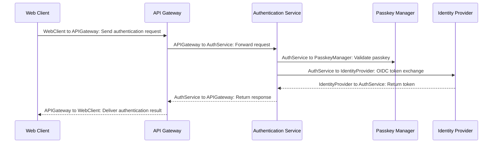

## Details

| Field               | Value                    |
|---------------------|--------------------------|
| **Unique ID**       | auth-flow-001                   |
| **Name**            | Authentication Flow                 |
| **Description**     | Sequence of steps for passwordless authentication using Passkeys and WebAuthn.          |

## Sequence Diagram

## Controls
    _No controls defined._

## Metadata
  _No Metadata defined._
