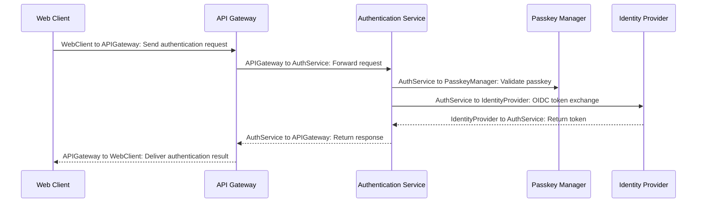

# Authentication Flow

## Details

    <table>
        <tbody>
        <tr>
            <th>Unique Id</th>
            <td>auth-flow-001</td>
        </tr>
        <tr>
            <th>Name</th>
            <td>Authentication Flow</td>
        </tr>
        <tr>
            <th>Description</th>
            <td>Sequence of steps for passwordless authentication using Passkeys and WebAuthn.</td>
        </tr>
        </tbody>
    </table>

## Sequence Diagram

## Controls
_No controls defined._

## Metadata

No metadata defined.

