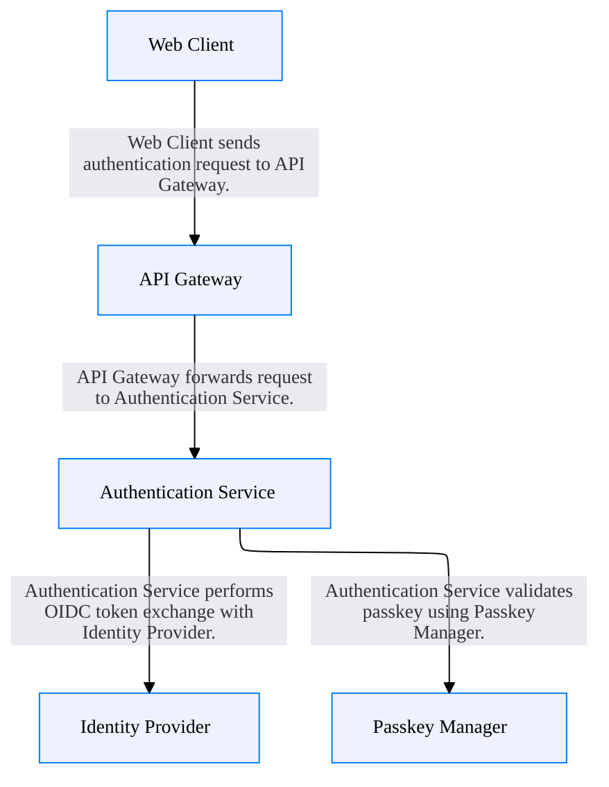

# Welcome to CALM Documentation

This documentation is generated from the **CALM Architecture-as-Code** model.

## High Level Architecture

## Nodes
- [Web Client](nodes/web-client)
- [API Gateway](nodes/api-gateway)
- [Authentication Service](nodes/auth-service)
- [Passkey Manager](nodes/passkey-manager)
- [Identity Provider](nodes/identity-provider)

## Relationships
- [Web Client To Api Gateway](relationships/web-client-to-api-gateway)
- [Api Gateway To Auth Service](relationships/api-gateway-to-auth-service)
- [Auth Service To Passkey Manager](relationships/auth-service-to-passkey-manager)
- [Auth Service To Identity Provider](relationships/auth-service-to-identity-provider)

## Flows
- [Authentication Flow](flows/auth-flow-001)

## Metadata

    <table>
        <thead>
        <tr>
            <th>Key</th>
            <th>Value</th>
        </tr>
        </thead>
        <tbody>
        <tr>
            <th>Name</th>
            <td>Passkey-WebAuthN-Architecture</td>
        </tr>
        <tr>
            <th>Description</th>
            <td>Passwordless authentication using Passkeys and WebAuthn</td>
        </tr>
        <tr>
            <th>Owner</th>
            <td>Identity Team</td>
        </tr>
        <tr>
            <th>Environment</th>
            <td>production</td>
        </tr>
        <tr>
            <th>CostCenter</th>
            <td>CC-1234</td>
        </tr>
        <tr>
            <th>Compliance</th>
            <td>PCI-DSS</td>
        </tr>
        </tbody>
    </table>

## ADRs
- [instructions/ADR-001.md](instructions/ADR-001.md)
- [instructions/ADR-002.md](instructions/ADR-002.md)
