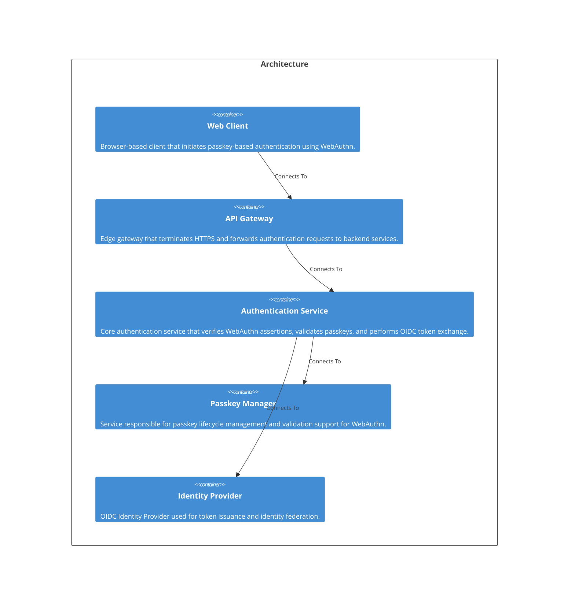

# Welcome to CALM Documentation

This documentation is generated from the **CALM Architecture-as-Code** model.

## High Level Architecture

## Nodes
    - [Web Client](nodes/web-client)
    - [API Gateway](nodes/api-gateway)
    - [Authentication Service](nodes/auth-service)
    - [Passkey Manager](nodes/passkey-manager)
    - [Identity Provider](nodes/identity-provider)

## Relationships
    - [Web Client To Api Gateway](relationships/web-client-to-api-gateway)
    - [Api Gateway To Auth Service](relationships/api-gateway-to-auth-service)
    - [Auth Service To Passkey Manager](relationships/auth-service-to-passkey-manager)
    - [Auth Service To Identity Provider](relationships/auth-service-to-identity-provider)

## Flows
    - [Authentication Flow](flows/auth-flow-001)

## Controls
| Requirement URL               | Category    | Scope        | Applied To                |
|-------------------------------|-----------|--------------|---------------------------|
|https://controls.calm.dev/TLS|tls|Node|auth-service|
|https://controls.calm.dev/TLS|tls|Node|passkey-manager|
|https://controls.calm.dev/TLS|tls|Node|identity-provider|
|https://controls.calm.dev/TLS|tls|Relationship|web-client-to-api-gateway|
|https://controls.calm.dev/TLS|tls|Relationship|api-gateway-to-auth-service|
|https://controls.calm.dev/TLS|tls|Relationship|auth-service-to-passkey-manager|
|https://controls.calm.dev/TLS|tls|Relationship|auth-service-to-identity-provider|
|https://controls.calm.dev/ZeroTrust|zero-trust|Node|auth-service|
|https://controls.calm.dev/ZeroTrust|zero-trust|Node|passkey-manager|
|https://controls.calm.dev/ZeroTrust|zero-trust|Node|identity-provider|
|https://controls.calm.dev/ZeroTrust|zero-trust|Relationship|api-gateway-to-auth-service|
|https://controls.calm.dev/ZeroTrust|zero-trust|Relationship|auth-service-to-passkey-manager|
|https://controls.calm.dev/ZeroTrust|zero-trust|Relationship|auth-service-to-identity-provider|
|https://controls.calm.dev/PhishingResistance|phishing-resistance|Node|auth-service|

## Metadata
  

      <table>
          <thead>
          <tr>
              <th>Key</th>
              <th>Value</th>
          </tr>
          </thead>
          <tbody>
          <tr>
              <td>
                  <b>Name</b>
              </td>
              <td>
                  Passkey-WebAuthN-Architecture
                      </td>
          </tr>
          <tr>
              <td>
                  <b>Description</b>
              </td>
              <td>
                  Passwordless authentication using Passkeys and WebAuthn
                      </td>
          </tr>
          <tr>
              <td>
                  <b>Owner</b>
              </td>
              <td>
                  Identity Team
                      </td>
          </tr>
          <tr>
              <td>
                  <b>Environment</b>
              </td>
              <td>
                  production
                      </td>
          </tr>
          <tr>
              <td>
                  <b>CostCenter</b>
              </td>
              <td>
                  CC-1234
                      </td>
          </tr>
          <tr>
              <td>
                  <b>Compliance</b>
              </td>
              <td>
                  PCI-DSS
                      </td>
          </tr>
          </tbody>
      </table>
  

## Adrs
- [instructions/ADR-001.md](instructions/ADR-001.md)
- [instructions/ADR-002.md](instructions/ADR-002.md)
