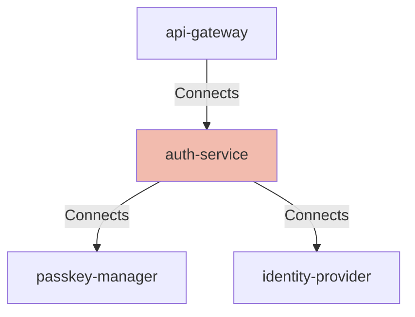

## Details

| Field               | Value                    |
|---------------------|--------------------------|
| **Unique ID**       | auth-service                   |
| **Node Type**       | service             |
| **Name**            | Authentication Service                 |
| **Description**     | Core authentication service that verifies WebAuthn assertions, validates passkeys, and performs OIDC token exchange.          |

## Interfaces
        

            <table>
                <thead>
                <tr>
                    <th>Key</th>
                    <th>Value</th>
                </tr>
                </thead>
                <tbody>
                <tr>
                    <td>
                        <b>UniqueId</b>
                    </td>
                    <td>
                        webauthn
                            </td>
                </tr>
                <tr>
                    <td>
                        <b>AdditionalProperties</b>
                    </td>
                    <td>
                        

                            <table>
                                <thead>
                                <tr>
                                    <th>Key</th>
                                    <th>Value</th>
                                </tr>
                                </thead>
                                <tbody>
                                <tr>
                                    <td>
                                        <b>Interface Type</b>
                                    </td>
                                    <td>
                                        WebAuthn
                                            </td>
                                </tr>
                                </tbody>
                            </table>
                        

                    </td>
                </tr>
                </tbody>
            </table>
        

## Related Nodes

## Controls

        ### Tls

        Encrypt all inbound and outbound authentication traffic.

        

            <table>
                <thead>
                <tr>
                    <th>Requirement URL</th>
                    <th>Config</th>
                </tr>
                </thead>
                <tbody>
                    <tr>
                        <td>
                                <a href="https://controls.calm.dev/TLS" target="_blank">
                                    https://controls.calm.dev/TLS
                                </a>
                        </td>

                        <td>
                                <table>
                                    <thead>
                                    <tr>
                                        <th>Key</th>
                                        <th>Value</th>
                                    </tr>
                                    </thead>
                                    <tbody>
                                        <tr>
                                            <td>minimumVersion</td>
                                            <td>TLS1.2</td>
                                        </tr>
                                    </tbody>
                                </table>

                        </td>
                    </tr>
                </tbody>
            </table>
        

        ### Zero Trust

        Use strong identity and continuous verification for service calls.

        

            <table>
                <thead>
                <tr>
                    <th>Requirement URL</th>
                    <th>Config</th>
                </tr>
                </thead>
                <tbody>
                    <tr>
                        <td>
                                <a href="https://controls.calm.dev/ZeroTrust" target="_blank">
                                    https://controls.calm.dev/ZeroTrust
                                </a>
                        </td>

                        <td>
                                <table>
                                    <thead>
                                    <tr>
                                        <th>Key</th>
                                        <th>Value</th>
                                    </tr>
                                    </thead>
                                    <tbody>
                                        <tr>
                                            <td>serviceIdentity</td>
                                            <td>mTLS</td>
                                        </tr>
                                        <tr>
                                            <td>leastPrivilege</td>
                                            <td>true</td>
                                        </tr>
                                        <tr>
                                            <td>continuousVerification</td>
                                            <td>true</td>
                                        </tr>
                                    </tbody>
                                </table>

                        </td>
                    </tr>
                </tbody>
            </table>
        

        ### Phishing Resistance

        Require WebAuthn authentication bound to relying party origin.

        

            <table>
                <thead>
                <tr>
                    <th>Requirement URL</th>
                    <th>Config</th>
                </tr>
                </thead>
                <tbody>
                    <tr>
                        <td>
                                <a href="https://controls.calm.dev/PhishingResistance" target="_blank">
                                    https://controls.calm.dev/PhishingResistance
                                </a>
                        </td>

                        <td>
                                <table>
                                    <thead>
                                    <tr>
                                        <th>Key</th>
                                        <th>Value</th>
                                    </tr>
                                    </thead>
                                    <tbody>
                                        <tr>
                                            <td>mechanism</td>
                                            <td>webauthn</td>
                                        </tr>
                                        <tr>
                                            <td>originBound</td>
                                            <td>true</td>
                                        </tr>
                                        <tr>
                                            <td>userVerification</td>
                                            <td>required</td>
                                        </tr>
                                    </tbody>
                                </table>

                        </td>
                    </tr>
                </tbody>
            </table>
        

## Metadata
  

      <table>
          <thead>
          <tr>
              <th>Key</th>
              <th>Value</th>
          </tr>
          </thead>
          <tbody>
          <tr>
              <td>
                  <b>Owner</b>
              </td>
              <td>
                  Identity Team
                      </td>
          </tr>
          <tr>
              <td>
                  <b>Environment</b>
              </td>
              <td>
                  production
                      </td>
          </tr>
          <tr>
              <td>
                  <b>Compliance</b>
              </td>
              <td>
                  PCI-DSS
                      </td>
          </tr>
          </tbody>
      </table>
  

