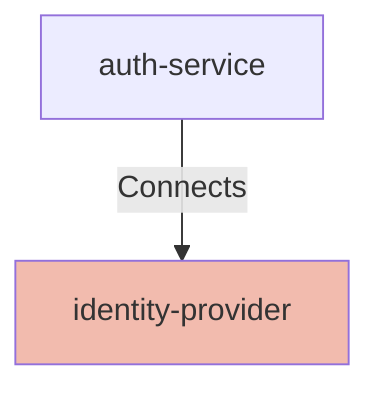

## Details

| Field               | Value                    |
|---------------------|--------------------------|
| **Unique ID**       | identity-provider                   |
| **Node Type**       | service             |
| **Name**            | Identity Provider                 |
| **Description**     | OIDC Identity Provider used for token issuance and identity federation.          |

## Interfaces
        

            <table>
                <thead>
                <tr>
                    <th>Key</th>
                    <th>Value</th>
                </tr>
                </thead>
                <tbody>
                <tr>
                    <td>
                        <b>UniqueId</b>
                    </td>
                    <td>
                        oidc
                            </td>
                </tr>
                <tr>
                    <td>
                        <b>AdditionalProperties</b>
                    </td>
                    <td>
                        

                            <table>
                                <thead>
                                <tr>
                                    <th>Key</th>
                                    <th>Value</th>
                                </tr>
                                </thead>
                                <tbody>
                                <tr>
                                    <td>
                                        <b>Interface Type</b>
                                    </td>
                                    <td>
                                        OIDC
                                            </td>
                                </tr>
                                </tbody>
                            </table>
                        

                    </td>
                </tr>
                </tbody>
            </table>
        

## Related Nodes

## Controls

        ### Tls

        Protect OIDC endpoints and token exchanges with TLS.

        

            <table>
                <thead>
                <tr>
                    <th>Requirement URL</th>
                    <th>Config</th>
                </tr>
                </thead>
                <tbody>
                    <tr>
                        <td>
                                <a href="https://controls.calm.dev/TLS" target="_blank">
                                    https://controls.calm.dev/TLS
                                </a>
                        </td>

                        <td>
                                <table>
                                    <thead>
                                    <tr>
                                        <th>Key</th>
                                        <th>Value</th>
                                    </tr>
                                    </thead>
                                    <tbody>
                                        <tr>
                                            <td>minimumVersion</td>
                                            <td>TLS1.2</td>
                                        </tr>
                                    </tbody>
                                </table>

                        </td>
                    </tr>
                </tbody>
            </table>
        

        ### Zero Trust

        Ensure token exchanges are authorized and continuously verified.

        

            <table>
                <thead>
                <tr>
                    <th>Requirement URL</th>
                    <th>Config</th>
                </tr>
                </thead>
                <tbody>
                    <tr>
                        <td>
                                <a href="https://controls.calm.dev/ZeroTrust" target="_blank">
                                    https://controls.calm.dev/ZeroTrust
                                </a>
                        </td>

                        <td>
                                <table>
                                    <thead>
                                    <tr>
                                        <th>Key</th>
                                        <th>Value</th>
                                    </tr>
                                    </thead>
                                    <tbody>
                                        <tr>
                                            <td>leastPrivilege</td>
                                            <td>true</td>
                                        </tr>
                                        <tr>
                                            <td>continuousVerification</td>
                                            <td>true</td>
                                        </tr>
                                    </tbody>
                                </table>

                        </td>
                    </tr>
                </tbody>
            </table>
        

## Metadata
  

      <table>
          <thead>
          <tr>
              <th>Key</th>
              <th>Value</th>
          </tr>
          </thead>
          <tbody>
          <tr>
              <td>
                  <b>Owner</b>
              </td>
              <td>
                  Identity Team
                      </td>
          </tr>
          <tr>
              <td>
                  <b>Environment</b>
              </td>
              <td>
                  production
                      </td>
          </tr>
          <tr>
              <td>
                  <b>Compliance</b>
              </td>
              <td>
                  PCI-DSS
                      </td>
          </tr>
          </tbody>
      </table>
  

