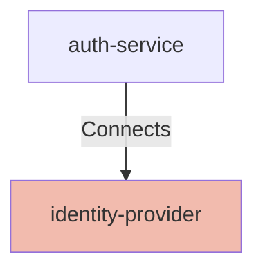

# Identity Provider

## Details

    <table>
        <tbody>
        <tr>
            <th>Unique Id</th>
            <td>identity-provider</td>
        </tr>
        <tr>
            <th>Name</th>
            <td>Identity Provider</td>
        </tr>
        <tr>
            <th>Description</th>
            <td>OIDC Identity Provider used for token issuance and identity federation.</td>
        </tr>
        <tr>
            <th>Node Type</th>
            <td>service</td>
        </tr>
        </tbody>
    </table>

## Interfaces

    <table>
        <thead>
        <tr>
            <th>Key</th>
            <th>Value</th>
        </tr>
        </thead>
        <tbody>
        <tr>
            <td><b>Unique Id</b></td>
            <td>
                <table class="nested-table">
                        <tbody>
                        <tr>
                            <td><b>Value</b></td>
                            <td>
                                oidc
                                    </td>
                        </tr>
                        <tr>
                            <td><b>Unique Id</b></td>
                            <td>
                                unique-id
                                    </td>
                        </tr>
                        </tbody>
                    </table>
            </td>
        </tr>
        <tr>
            <td><b>Interface Type</b></td>
            <td>
                <table class="nested-table">
                        <tbody>
                        <tr>
                            <td><b>Value</b></td>
                            <td>
                                OIDC
                                    </td>
                        </tr>
                        <tr>
                            <td><b>Unique Id</b></td>
                            <td>
                                interface-type
                                    </td>
                        </tr>
                        </tbody>
                    </table>
            </td>
        </tr>
        </tbody>
    </table>

## Related Nodes

## Controls
### Tls

Protect OIDC endpoints and token exchanges with TLS.

    <table>
        <thead>
        <tr>
            <th>Key</th>
            <th>Value</th>
        </tr>
        </thead>
        <tbody>
        <tr>
            <td><b>0</b></td>
            <td>
                <table class="nested-table">
                        <tbody>
                        <tr>
                            <td><b>Requirement Url</b></td>
                            <td>
                                https://controls.calm.dev/TLS
                                    </td>
                        </tr>
                        <tr>
                            <td><b>MinimumVersion</b></td>
                            <td>
                                TLS1.2
                                    </td>
                        </tr>
                        </tbody>
                    </table>
            </td>
        </tr>
        </tbody>
    </table>

### Zero Trust

Ensure token exchanges are authorized and continuously verified.

    <table>
        <thead>
        <tr>
            <th>Key</th>
            <th>Value</th>
        </tr>
        </thead>
        <tbody>
        <tr>
            <td><b>0</b></td>
            <td>
                <table class="nested-table">
                        <tbody>
                        <tr>
                            <td><b>Requirement Url</b></td>
                            <td>
                                https://controls.calm.dev/ZeroTrust
                                    </td>
                        </tr>
                        <tr>
                            <td><b>LeastPrivilege</b></td>
                            <td>
                                true
                                    </td>
                        </tr>
                        <tr>
                            <td><b>ContinuousVerification</b></td>
                            <td>
                                true
                                    </td>
                        </tr>
                        </tbody>
                    </table>
            </td>
        </tr>
        </tbody>
    </table>

## Metadata

    <table>
        <thead>
        <tr>
            <th>Key</th>
            <th>Value</th>
        </tr>
        </thead>
        <tbody>
        <tr>
            <th>Owner</th>
            <td>Identity Team</td>
        </tr>
        <tr>
            <th>Environment</th>
            <td>production</td>
        </tr>
        <tr>
            <th>Compliance</th>
            <td>PCI-DSS</td>
        </tr>
        </tbody>
    </table>

