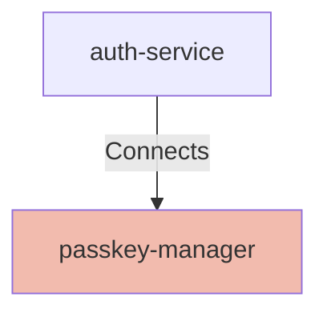

# Passkey Manager

## Details

    <table>
        <tbody>
        <tr>
            <th>Unique Id</th>
            <td>passkey-manager</td>
        </tr>
        <tr>
            <th>Name</th>
            <td>Passkey Manager</td>
        </tr>
        <tr>
            <th>Description</th>
            <td>Service responsible for passkey lifecycle management and validation support for WebAuthn.</td>
        </tr>
        <tr>
            <th>Node Type</th>
            <td>service</td>
        </tr>
        </tbody>
    </table>

## Interfaces

No interfaces defined.

## Related Nodes

## Controls
### Tls

Secure service-to-service communication with strong transport encryption.

    <table>
        <thead>
        <tr>
            <th>Key</th>
            <th>Value</th>
        </tr>
        </thead>
        <tbody>
        <tr>
            <td><b>0</b></td>
            <td>
                <table class="nested-table">
                        <tbody>
                        <tr>
                            <td><b>Requirement Url</b></td>
                            <td>
                                https://controls.calm.dev/TLS
                                    </td>
                        </tr>
                        <tr>
                            <td><b>Mode</b></td>
                            <td>
                                mTLS
                                    </td>
                        </tr>
                        </tbody>
                    </table>
            </td>
        </tr>
        </tbody>
    </table>

### Zero Trust

Authorize requests using least privilege and continuous verification.

    <table>
        <thead>
        <tr>
            <th>Key</th>
            <th>Value</th>
        </tr>
        </thead>
        <tbody>
        <tr>
            <td><b>0</b></td>
            <td>
                <table class="nested-table">
                        <tbody>
                        <tr>
                            <td><b>Requirement Url</b></td>
                            <td>
                                https://controls.calm.dev/ZeroTrust
                                    </td>
                        </tr>
                        <tr>
                            <td><b>ServiceIdentity</b></td>
                            <td>
                                mTLS
                                    </td>
                        </tr>
                        <tr>
                            <td><b>LeastPrivilege</b></td>
                            <td>
                                true
                                    </td>
                        </tr>
                        <tr>
                            <td><b>ContinuousVerification</b></td>
                            <td>
                                true
                                    </td>
                        </tr>
                        </tbody>
                    </table>
            </td>
        </tr>
        </tbody>
    </table>

## Metadata

    <table>
        <thead>
        <tr>
            <th>Key</th>
            <th>Value</th>
        </tr>
        </thead>
        <tbody>
        <tr>
            <th>Owner</th>
            <td>Identity Team</td>
        </tr>
        <tr>
            <th>Environment</th>
            <td>production</td>
        </tr>
        <tr>
            <th>Compliance</th>
            <td>PCI-DSS</td>
        </tr>
        </tbody>
    </table>

