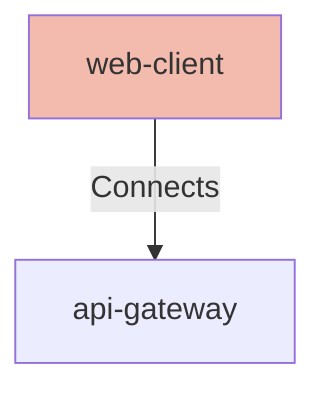

# Web Client

## Details

    <table>
        <tbody>
        <tr>
            <th>Unique Id</th>
            <td>web-client</td>
        </tr>
        <tr>
            <th>Name</th>
            <td>Web Client</td>
        </tr>
        <tr>
            <th>Description</th>
            <td>Browser-based client that initiates passkey-based authentication using WebAuthn.</td>
        </tr>
        <tr>
            <th>Node Type</th>
            <td>webclient</td>
        </tr>
        </tbody>
    </table>

## Interfaces

No interfaces defined.

## Related Nodes

## Controls
_No controls defined._

## Metadata

    <table>
        <thead>
        <tr>
            <th>Key</th>
            <th>Value</th>
        </tr>
        </thead>
        <tbody>
        <tr>
            <th>Owner</th>
            <td>Identity Team</td>
        </tr>
        <tr>
            <th>Environment</th>
            <td>production</td>
        </tr>
        <tr>
            <th>Compliance</th>
            <td>PCI-DSS</td>
        </tr>
        </tbody>
    </table>

