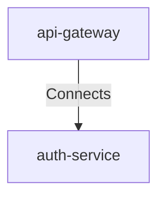

# Api Gateway To Auth Service

## Details

    <table>
        <tbody>
        <tr>
            <th>Unique Id</th>
            <td>api-gateway-to-auth-service</td>
        </tr>
        <tr>
            <th>Description</th>
            <td>API Gateway forwards request to Authentication Service.</td>
        </tr>
        <tr>
            <th>Protocol</th>
            <td>HTTPS</td>
        </tr>
        </tbody>
    </table>

## Related Nodes

## Controls
### Tls

Encrypt edge-to-service traffic.

    <table>
        <thead>
        <tr>
            <th>Key</th>
            <th>Value</th>
        </tr>
        </thead>
        <tbody>
        <tr>
            <td><b>0</b></td>
            <td>
                <table class="nested-table">
                        <tbody>
                        <tr>
                            <td><b>Requirement Url</b></td>
                            <td>
                                https://controls.calm.dev/TLS
                                    </td>
                        </tr>
                        <tr>
                            <td><b>MinimumVersion</b></td>
                            <td>
                                TLS1.2
                                    </td>
                        </tr>
                        </tbody>
                    </table>
            </td>
        </tr>
        </tbody>
    </table>

### Zero Trust

Apply least privilege and continuous verification between gateway and auth service.

    <table>
        <thead>
        <tr>
            <th>Key</th>
            <th>Value</th>
        </tr>
        </thead>
        <tbody>
        <tr>
            <td><b>0</b></td>
            <td>
                <table class="nested-table">
                        <tbody>
                        <tr>
                            <td><b>Requirement Url</b></td>
                            <td>
                                https://controls.calm.dev/ZeroTrust
                                    </td>
                        </tr>
                        <tr>
                            <td><b>LeastPrivilege</b></td>
                            <td>
                                true
                                    </td>
                        </tr>
                        <tr>
                            <td><b>ContinuousVerification</b></td>
                            <td>
                                true
                                    </td>
                        </tr>
                        </tbody>
                    </table>
            </td>
        </tr>
        </tbody>
    </table>

## Metadata

    <table>
        <thead>
        <tr>
            <th>Key</th>
            <th>Value</th>
        </tr>
        </thead>
        <tbody>
        <tr>
            <th>Criticality</th>
            <td>high</td>
        </tr>
        </tbody>
    </table>

