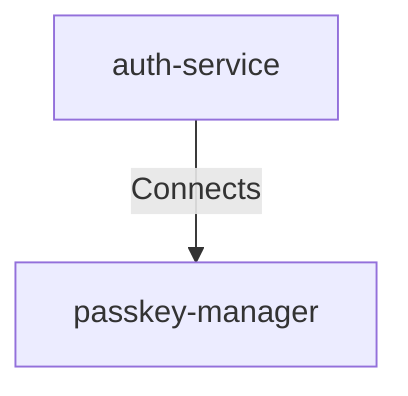

# Auth Service To Passkey Manager

## Details

    <table>
        <tbody>
        <tr>
            <th>Unique Id</th>
            <td>auth-service-to-passkey-manager</td>
        </tr>
        <tr>
            <th>Description</th>
            <td>Authentication Service validates passkey using Passkey Manager.</td>
        </tr>
        <tr>
            <th>Protocol</th>
            <td>mTLS</td>
        </tr>
        </tbody>
    </table>

## Related Nodes

## Controls
### Tls

Require mutually authenticated TLS for passkey validation requests.

    <table>
        <thead>
        <tr>
            <th>Key</th>
            <th>Value</th>
        </tr>
        </thead>
        <tbody>
        <tr>
            <td><b>0</b></td>
            <td>
                <table class="nested-table">
                        <tbody>
                        <tr>
                            <td><b>Requirement Url</b></td>
                            <td>
                                https://controls.calm.dev/TLS
                                    </td>
                        </tr>
                        <tr>
                            <td><b>Mode</b></td>
                            <td>
                                mTLS
                                    </td>
                        </tr>
                        </tbody>
                    </table>
            </td>
        </tr>
        </tbody>
    </table>

### Zero Trust

Enforce strong service identity and least privilege for passkey operations.

    <table>
        <thead>
        <tr>
            <th>Key</th>
            <th>Value</th>
        </tr>
        </thead>
        <tbody>
        <tr>
            <td><b>0</b></td>
            <td>
                <table class="nested-table">
                        <tbody>
                        <tr>
                            <td><b>Requirement Url</b></td>
                            <td>
                                https://controls.calm.dev/ZeroTrust
                                    </td>
                        </tr>
                        <tr>
                            <td><b>ServiceIdentity</b></td>
                            <td>
                                mTLS
                                    </td>
                        </tr>
                        <tr>
                            <td><b>LeastPrivilege</b></td>
                            <td>
                                true
                                    </td>
                        </tr>
                        <tr>
                            <td><b>ContinuousVerification</b></td>
                            <td>
                                true
                                    </td>
                        </tr>
                        </tbody>
                    </table>
            </td>
        </tr>
        </tbody>
    </table>

## Metadata

    <table>
        <thead>
        <tr>
            <th>Key</th>
            <th>Value</th>
        </tr>
        </thead>
        <tbody>
        <tr>
            <th>Criticality</th>
            <td>high</td>
        </tr>
        <tr>
            <th>Sensitivity</th>
            <td>high</td>
        </tr>
        </tbody>
    </table>

