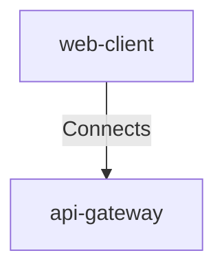

## Details

| Field               | Value                    |
|---------------------|--------------------------|
| **Unique ID**       | web-client-to-api-gateway                   |
| **Description**      |  Web Client sends authentication request to API Gateway.   |

## Related Nodes

## Controls

        ### Tls

        Encrypt client-to-edge traffic.

        

            <table>
                <thead>
                <tr>
                    <th>Requirement URL</th>
                    <th>Config</th>
                </tr>
                </thead>
                <tbody>
                    <tr>
                        <td>
                                <a href="https://controls.calm.dev/TLS" target="_blank">
                                    https://controls.calm.dev/TLS
                                </a>
                        </td>

                        <td>
                                <table>
                                    <thead>
                                    <tr>
                                        <th>Key</th>
                                        <th>Value</th>
                                    </tr>
                                    </thead>
                                    <tbody>
                                        <tr>
                                            <td>minimumVersion</td>
                                            <td>TLS1.2</td>
                                        </tr>
                                    </tbody>
                                </table>

                        </td>
                    </tr>
                </tbody>
            </table>
        

## Metadata
  

      <table>
          <thead>
          <tr>
              <th>Key</th>
              <th>Value</th>
          </tr>
          </thead>
          <tbody>
          <tr>
              <td>
                  <b>Criticality</b>
              </td>
              <td>
                  high
                      </td>
          </tr>
          </tbody>
      </table>
  

