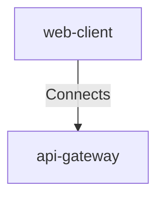

# Web Client To Api Gateway

## Details

    <table>
        <tbody>
        <tr>
            <th>Unique Id</th>
            <td>web-client-to-api-gateway</td>
        </tr>
        <tr>
            <th>Description</th>
            <td>Web Client sends authentication request to API Gateway.</td>
        </tr>
        <tr>
            <th>Protocol</th>
            <td>HTTPS</td>
        </tr>
        </tbody>
    </table>

## Related Nodes

## Controls
### Tls

Encrypt client-to-edge traffic.

    <table>
        <thead>
        <tr>
            <th>Key</th>
            <th>Value</th>
        </tr>
        </thead>
        <tbody>
        <tr>
            <td><b>0</b></td>
            <td>
                <table class="nested-table">
                        <tbody>
                        <tr>
                            <td><b>Requirement Url</b></td>
                            <td>
                                https://controls.calm.dev/TLS
                                    </td>
                        </tr>
                        <tr>
                            <td><b>MinimumVersion</b></td>
                            <td>
                                TLS1.2
                                    </td>
                        </tr>
                        </tbody>
                    </table>
            </td>
        </tr>
        </tbody>
    </table>

## Metadata

    <table>
        <thead>
        <tr>
            <th>Key</th>
            <th>Value</th>
        </tr>
        </thead>
        <tbody>
        <tr>
            <th>Criticality</th>
            <td>high</td>
        </tr>
        </tbody>
    </table>

